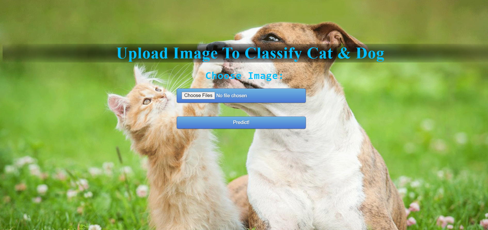
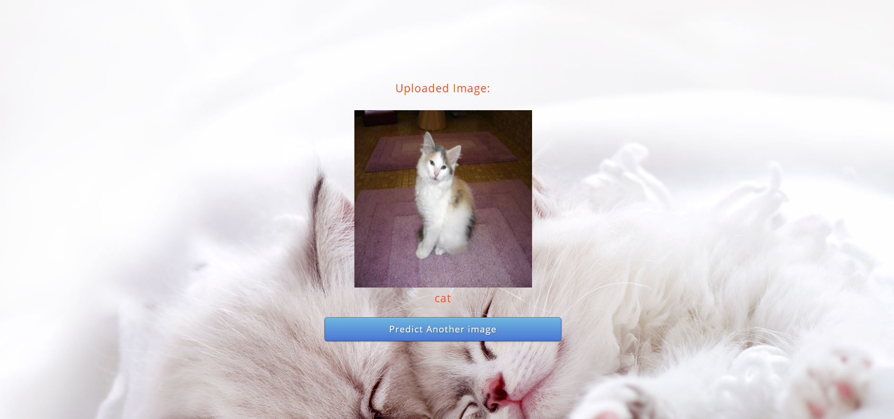

# Cat-Dog-Classification-Flask-App
## Homepage

## Prediction Page

### Introduction
In this project, we'll write an algorithm to classify whether images contain either a dog or a cat.  This is easy for humans, dogs, and cats but our computer will find it a bit more difficult.
### Data Description
The folder "train" contains two sub-folders "cats" & "dogs" which contain images of cats and dogs respectively.The folder "test1" contain unknown images which we have to classify.
### Data
To download the Dataset click [here](https://www.kaggle.com/c/dogs-vs-cats/data)
### Objective
To build a deep learning classification model which classify whether images contain either a dog or a cat.
### How To Run
- Step-1: Download this repository.
- Step-2: Download the model from [here](https://drive.google.com/file/d/1dVgI5xM9quI8ua8OpFwkpxLZmzcf3sfE/view?usp=sharing).Move the downloaded model into project folder.
- Step-3: In command prompt,go to this project directory.
- Step-4: Run this command.<code>python app.py</code>
- Step-5: Copy the generated host link & open in local browser.
        (In my case the link is <code>http://127.0.0.1:5000/ </code>)
### troubleshoot
Any issues??? Feel free to ask.[Linkedin](https://www.linkedin.com/in/sidharth178/)
 
If you find this repo useful don't forget to give a ⭐ 

Thanks! ❤️
